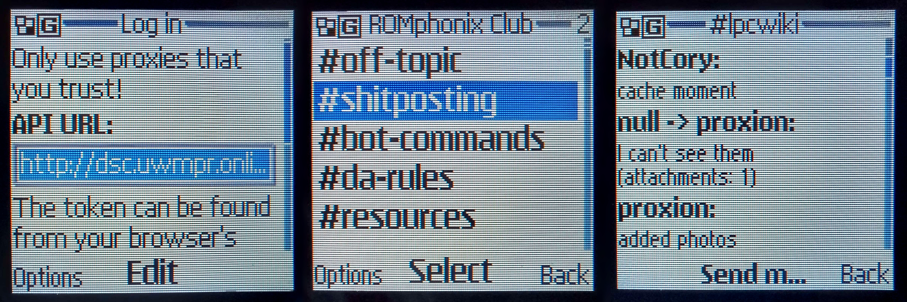

# Discord for J2ME
Discord client for Java ME (MIDP 2.0) devices, inspired by [Discord for Symbian](https://github.com/uwmpr/discord-symbian-fixed). Uses a [proxy server](https://github.com/uwmpr/discord-symbian-fixed/blob/master/dscproxysetup.md) (dsc.uwmpr.online is the default).

## Status
### Working
* Server list
* Channel list
* Message reading (newest message on top)
* Message sending
* Direct messages (not group DMs)

### Not implemented
* WebSocket (live message updates)
* Reading older messages
* Replying to messages
* Ping/unread indicators
* Pretty much everything else

## How to build
1. Create an `sdk` folder inside the repo with the following contents:
    * `jdk1.6.0_45` folder containing that version of the Java Development Kit.
        * If you have another JDK installation that supports Java 1.3, you can change the `JAVA_HOME` variable in `build.sh` to point to it.
    * `cldcapi11.jar` and `midpapi20.jar` from the Sun Wireless Toolkit.
    * `proguard.jar` (can be found in the `lib` folder inside the ZIP available [here](https://github.com/Guardsquare/proguard/releases))
2. Run `build.sh`.

## Thanks
* [@uwmpr](https://github.com/uwmpr) for hosting the default proxy server
* [@shinovon](https://github.com/shinovon) for their Java ME [JSON library](https://github.com/shinovon/NNJSON)