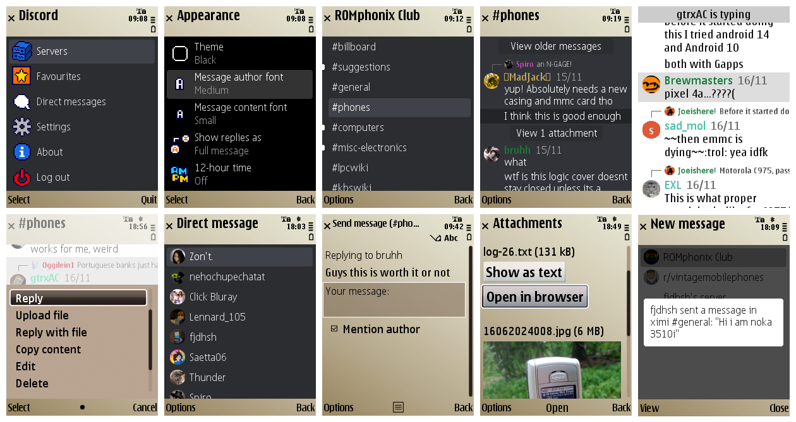

# Discord for J2ME
Discord client for Java ME (MIDP 1.0 and 2.0) devices, inspired by [Discord for Symbian](https://github.com/uwmpr/discord-symbian-fixed). Uses proxy servers for the [HTTP](/proxy/) and [gateway](https://github.com/gtrxAC/discord-j2me-server) connection.

Also see [Droidcord](https://github.com/leap0x7b/Droidcord), a Discord client for old Android devices.

* [Download](https://github.com/gtrxAC/discord-j2me/releases/latest)
* [FAQ](https://github.com/gtrxAC/discord-j2me/wiki/FAQ)
* [Discord server](https://discord.gg/2GKuJjQagp) (#discord-j2me)
* [Telegram group](https://t.me/dscforsymbian)

## Status
### Working
* Server and channel lists
* Message reading, sending, editing, <abbr title="Only your own messages">deleting</abbr>
* Replying to messages
* Reading older messages
* Direct messages and group DMs
* Attachment viewing
* Attachment sending (<abbr title="Requires FileConnection API or HTML browser with file uploading support">device dependent</abbr>)
* Gateway/live message updates (<abbr title="Not supported on MIDP 1.0">device dependent</abbr>)
* <abbr title="Not in sync with official clients">Unread message indicators</abbr>

### Not implemented
* Jumping to messages (e.g. replies)
* Initiating DM conversations
* Ping indicators
* Reactions and emojis

## How to build
1. Install [Node.js](https://nodejs.org).
2. Download [Temurin OpenJDK 8](https://adoptium.net/temurin/releases/?version=8&package=jdk) (zip or tar.gz). Extract the package into the `sdk` folder. Make sure there is a sub-folder named something like `sdk/jdk8u...`.
3. Download [ProGuard](https://github.com/Guardsquare/proguard/releases/latest). Extract the package and copy the extracted `lib/proguard.jar` file into the `sdk` folder.
4. Download [midpapi20](https://github.com/vipaoL/j2me-build-tools/raw/c1598b6916f2ba2ad5be1c0accd1ed2a54c156f3/WTK2.5.2/lib/midpapi20.jar), [cldcapi10](https://github.com/vipaoL/j2me-build-tools/raw/c1598b6916f2ba2ad5be1c0accd1ed2a54c156f3/WTK2.5.2/lib/cldcapi10.jar), [jsr75](https://github.com/vipaoL/j2me-build-tools/raw/c1598b6916f2ba2ad5be1c0accd1ed2a54c156f3/WTK2.5.2/lib/jsr75.jar), and [javapiglerapi](https://github.com/vipaoL/j2me-build-tools/raw/refs/heads/master/lib/javapiglerapi.jar) JARs. Place these in the `sdk/lib` folder.
5. Run `build.sh` (Linux) or `build.bat` (Windows).

## Thanks
* [@uwmpr](https://github.com/uwmpr) for formerly hosting the default proxy server
* [@WunderWungiel](https://github.com/WunderWungiel) for formerly hosting the CDN proxy
* [@shinovon](https://github.com/shinovon) for their Java ME [JSON library](https://github.com/shinovon/NNJSON)
* [@saetta06](https://github.com/saetta06) for creating the menu graphics and loading animation
* Language translation contributors (see About screen in the app)